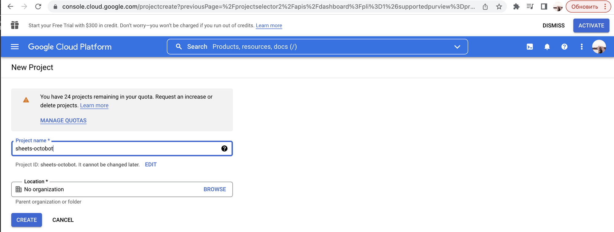
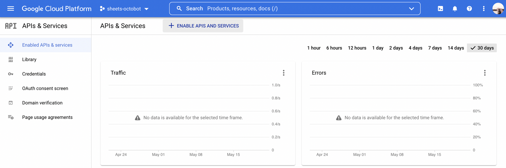
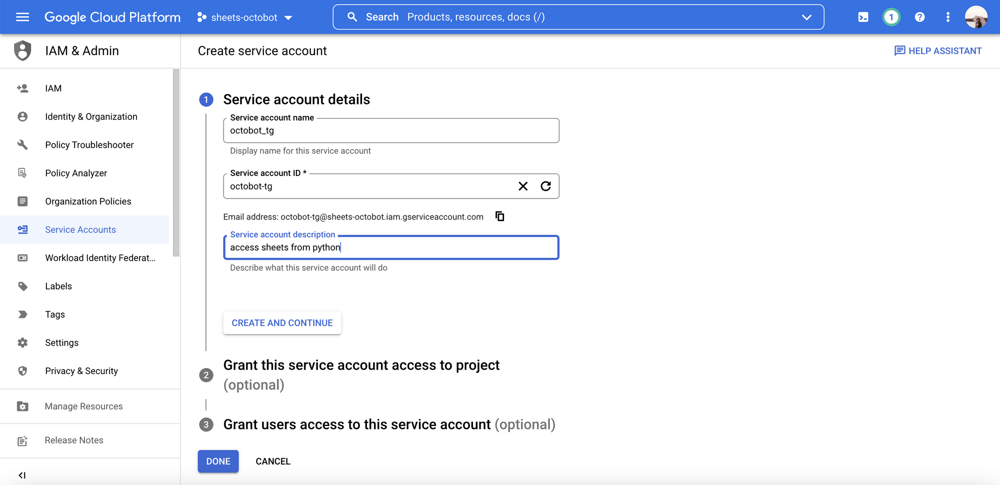
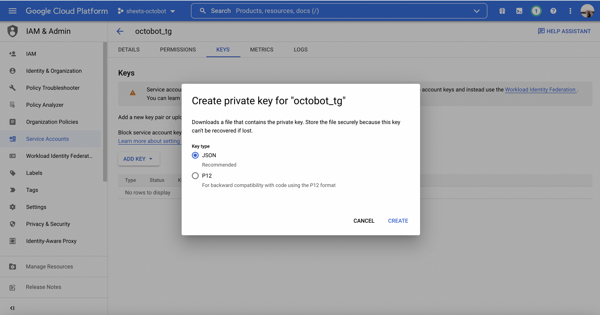
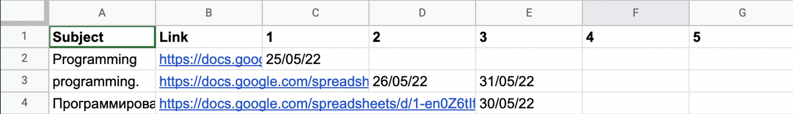

# Получение ключа для работы с Google-таблицами

### Прежде всего необходимо получить ключ доступа для управления сервисами Google. Для этого вы

1. Перейти по ссылке http://console.developers.google.com/. Найти пункт `“New Project”` и создать
   его. 
2. Выбрать `“Enable APIs and Services”`.
3. В поиске найти и активировать `Google Drive API` и `Google Sheets API`.
4. Перейти в раздел `Credentials` и выбрать `Create Credentials -> Service Account`. Вносим название
   приложения. 
5. В качестве роли выбираем `Actions Admin`.
6. После сохранения описания появится возможность добавить ключ. Выбираем формат `JSON`. Он автоматически скачается.
   Сохраняем его в одной директории с проектом и называем `credentials.json`.
7. Адресу `client_email` из `сredentials.json` даем доступ к заранее созданной Google-таблице.
8. Готово! Подключение – далее в шаблоне.

# Создаем бота в Telegram и получаем токен

1. Находим `@BotFather` в телеграм.
2. Отправляем `/start` и `/newbot`. Обратите также внимание, что через BotFather можно редактировать внешний вид вашего
   бота.
3. Придумываем имя бота и адрес.
4. Копируем красную строку - `ТОКЕН`.
5. Устанавливаем модуль [pyTelegramBotAPI](https://github.com/eternnoir/pyTelegramBotAPI). Там же можно найти примеры
   ботов и вдохновиться или почерпнуть идеи для реализации функций.

# Пишем бота, который будет помнить о ваших дедлайнах

Напишем бота, который будет обладать следующей базовой функциональностью:

- Подключением Google-таблицы
- Внесением и редактированием информации об изучаемых дисциплинах
- Внесением и редактированием информации о дедлайнах
- Выводом информации о ближайших дедлайных

Перечисленные функции выносятся в меню, которое вызывается по команде `/start`. Меню создается через
пользовательскую
клавиатуру классом `ReplyKeyboardMarkup`. Указываем, что нам нужно подгонять размер под экран и прятать клавиатуру
после
того, как выбор сделан. Строки меню могут содержать один или несколько элементов через запятую. Для перехода к
следующему хендлеру будем использовать метод `register_next_step_handler`. Метод принимает два параметра: действие,
после
которого нужно сделать переход, и указание – в какую функцию

```
.@bot.message_handler(commands=["start"])
def start(message):
    start_markup = telebot.types.ReplyKeyboardMarkup(resize_keyboard=True, one_time_keyboard=True)
    start_markup.row("Подключить Google-таблицу")
    start_markup.row("Посмотреть дедлайны на этой неделе")
    start_markup.row("Внести новый дедлайн")
    start_markup.row("Редактировать предметы")
    info = bot.send_message(message.chat.id, "Что хотите сделать?", reply_markup=start_markup)
    bot.register_next_step_handler(info, choose_action)
```

Ваша задача: усовершенствовать стартовое меню. Пункт `Подключить Google-таблицу` должен быть доступен только в том
случае, если таблица еще не подключена. Во всех остальных случаях - остальные три пункта. Также при запуске бота должны
сразу выводиться все сохраненные дисциплины. Названия должны быть кликабельными ссылками и указывать на таблицу с
баллами по дисциплине. Для этого можно воспользоваться html или markdown парсером через параметр `parse_mode`
в `send_message`.

При подключении к таблице, создается json-файл, хранящий ссылку и идентификатор таблицы. При работе бот использует
последнюю добавленную таблицу. Ваша задача здесь – извлечь идентификатор страницу (это часть ссылки после d/).

```
def connect_table(message):
    """ Подключаемся к Google-таблице """
    url = message.text
    sheet_id =  # Нужно извлечь id страницы из ссылки на Google-таблицу
    try:
        with open("tables.json") as json_file:
            tables = json.load(json_file)
        title = len(tables) + 1
        tables[title] = {"url": url, "id": sheet_id}
    except FileNotFoundError:
        tables = {0: {"url": url, "id": sheet_id}}
    with open('tables.json', 'w') as json_file:
        json.dump(tables, json_file)
    bot.send_message(message.chat.id, "Таблица подключена!")
```

Боту необходимо постоянно обращаться к имеющейся Google-таблице при поиске и изменении данных. Для этого воспользуемся
модулем [gspread](https://docs.gspread.org/en/latest/user-guide.html). Открывать таблицу будем по сохраненному
идентификатору. Обрабатывать таблицу удобно через `pandas`. Вся
информация хранится на Листе 1, поэтому сразу выделяем его в отдельные `worksheet`.

```
def access_current_sheet():
    """ Обращаемся к Google-таблице """
    with open("tables.json") as json_file:
        tables = json.load(json_file)

    sheet_id = tables[max(tables)]["id"]
    gc = gspread.service_account(filename="credentials.json")
    sh = gc.open_by_key(sheet_id)
    worksheet = sh.sheet1
    # Преобразуем Google-таблицу в таблицу pandas
    return worksheet, tables[max(tables)]["url"], df
```

Подключившись к таблице, можно переходить к реализации логики бота. Прежде всего, нужно описать, что будет происходить
при выборе каждого из пунктов стартового меню. Подключение к таблице описано выше. Остаются еще три пункта:

- Редактирование предметов должно открывать новое меню с выбором действия: добавление нового, редактирование или
  удаление
  имеющегося, удаление всего.
- Редактирование дедлайнов дает возможность добавить или изменить дату дедлайна. Изначально в таблице могут заданы или
  не заданы столбцы с номером работы. Будем считать, что дедлайн может только измениться, но не исчезнуть, поэтому
  удаление не рассматриваем. Будьте внимательны: `gspread` считает строки и столбцы с 1, а не с 0.



- Показать список дедлайнов на этой неделе. Неделей считаем ближайшие 7 дней, включая сегодня.

```def choose_action(message):
    """ Обрабатываем действия верхнего уровня """
    if message.text == "Подключить Google-таблицу":
        # PUT YOUR CODE HERE
        pass
    elif message.text == "Редактировать предметы":
        # PUT YOUR CODE HERE
        pass
    elif message.text == "Редактировать дедлайн":
        # PUT YOUR CODE HERE
        pass
    elif message.text == "Посмотреть дедлайны на этой неделе":
        # PUT YOUR CODE HERE
        pass
```

Для обработки действий над дисциплинами функция `choose_subject_action` должна реализовывать логику обработки меню,
аналогичную функции `choose_action`. То же касается функции `choose_deadline_action` для выбора действия с дедлайном и
функции `choose_removal_action`, которая уточняет у пользователя, точно ли он хочет удалить всю информацию.

```
def choose_subject_action(message):
    """ Выбираем действие в разделе Редактировать предметы """
    # PUT YOUR CODE HERE
    pass


def choose_deadline_action(message):
    """ Выбираем действие в разделе Редактировать дедлайн """
    # PUT YOUR CODE HERE
    pass


def choose_removal_option(message):
    """ Уточняем, точно ли надо удалить все """
    # PUT YOUR CODE HERE
    pass
```

Функции `add_new_subject` и `add_new_subject_url` добавляют новую дисциплину в конец таблицы, например, так:

```
worksheet.append_row([title, url])
```

Также можно воспользоваться методом `insert_row` или `update_cell`, чтобы добавить дисциплину в определенную строку или
ячейку. Функция `update_subject` должна по названию предмета запрашивать новое название и ссылку для выбранного
предмета,
не меняя его позиции в списке. Выбор предмета удобно реализовать через меню, содержащее все названия дисциплин в
таблице. Дополнительные функции для этого в шаблоне отсутствуют.

```
def add_new_subject(message):
    """ Вносим новое название предмета в Google-таблицу """
    # PUT YOUR CODE HERE
    pass


def add_new_subject_url(message):
    """ Вносим новую ссылку на таблицу предмета в Google-таблицу """
    # PUT YOUR CODE HERE
    pass


def update_subject(message):
    """ Обновляем информацию о предмете в Google-таблице """
    # PUT YOUR CODE HERE
    pass
```

Логика редактирования дедлайна аналогична логике редактирования дисциплины: необходимо выбрать предмет, ввести номер
работы, а затем запросить дату. При работе с датами можно показывать пользователю эталонный вариант записи даты, который
вы далее будете парсить через `datetime` или воспользоваться модулем dateutil, который умеет распознавать любой формат
даты. Обработку даты будем выполнять отдельной функцией `convert_date`.

```
def choose_subject(message):
    """ Выбираем предмет, у которого надо отредактировать дедлайн """
    # PUT YOUR CODE HERE
    pass


def update_subject_deadline(message):
    """ Обновляем дедлайн """
    # PUT YOUR CODE HERE
    pass


def convert_date(date: str = "01/01/00"):
    """ Конвертируем дату из строки в datetime """
    # PUT YOUR CODE HERE
    pass
```

Теперь у нас есть функции для редактирования дисциплин и дедлайнов. В конце семестра может захотеться удалить лишние или
все дисциплины из списка. Напишем для этого соответствующие функции. Для удаление будем использовать метод `delete_rows`.


```
def delete_subject(message):
    """ Удаляем предмет в Google-таблице """
    # PUT YOUR CODE HERE
    pass


def clear_subject_list(message):
    """Удаляем все из Google-таблицы"""
    # PUT YOUR CODE HERE
    pass
```